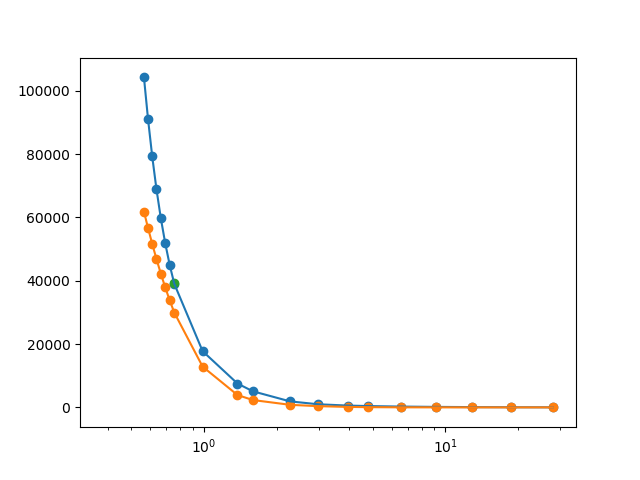
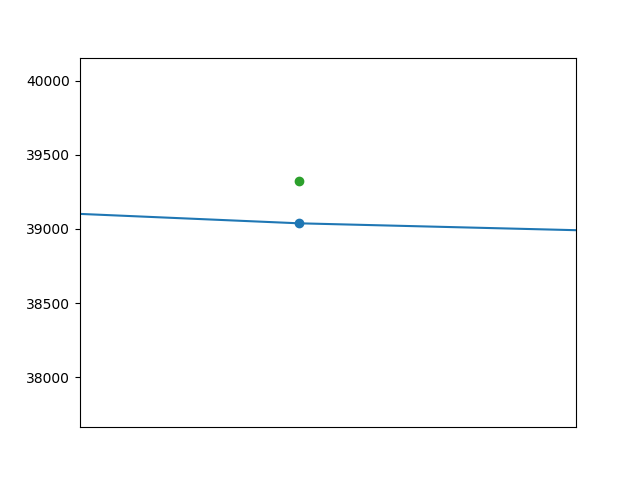

#   Optimization of JWL equation for RDX
Optimizing The JWL equation for explosive state for RDX.
For this purpose we are using Levenberg Marquardt Algorithm
We use to Determine the constants for isentropic equation
1. R1
2. R2
3. A
4. B
5. C

